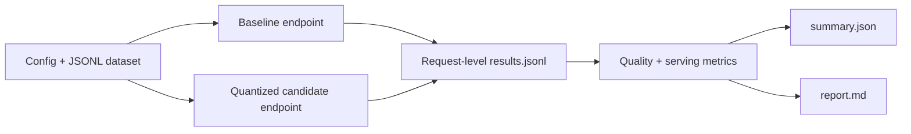

# LLM Quant Bench

[](https://github.com/yinli-systems/llm-quant-bench/actions/workflows/ci.yml)

LLM Quant Bench is a dependency-free Python toolkit for answering two different questions about a quantized language model:

1. Does it preserve enough task quality relative to a matched baseline?
2. Can an already-running service meet a defined latency, throughput, stability, and context-length target?

It drives OpenAI-compatible `/v1/chat/completions` endpoints, records request-level JSONL, and produces machine-readable summaries plus a Markdown report. It works with services such as vLLM, SGLang, TGI, llama.cpp server, and compatible gateways.

The toolkit does **not** quantize a model, launch a serving runtime, or make an unmeasured “lossless” claim.

## Why This Exists

Quantization work often stops at “the checkpoint loads” or a single tokens-per-second number. That is not enough to decide whether a model is usable. A defensible evaluation needs the same prompts and decoding controls for baseline and candidate, explicit scoring coverage, request-level latency, sustained-load evidence, and a record of what was not measured.

LLM Quant Bench keeps those concerns in one small pipeline:



## Quick Start

Requirements:

- Python 3.10 or newer
- no third-party runtime dependencies for the core package

Run the local end-to-end smoke path:

```bash
python3 -m llm_quant_bench demo --out runs/demo
```

The demo starts local mock OpenAI-compatible endpoints and writes:

```text
runs/demo/results.jsonl
runs/demo/summary.json
runs/demo/report.md
```

This proves the local benchmark pipeline, not GPU serving performance.

Run the test suite:

```bash
python3 -m unittest discover -s tests -v
```

## Core Workflows

| Workflow | Command | Question answered |
| --- | --- | --- |
| Local smoke | `python3 -m llm_quant_bench demo --out runs/demo` | Does the benchmark pipeline work end to end? |
| Paired evaluation | `python3 -m llm_quant_bench run ...` | How does the candidate compare with a matched baseline? |
| Candidate load | `python3 -m llm_quant_bench load ...` | What serving envelope does one candidate endpoint sustain? |
| Re-summarize | `python3 -m llm_quant_bench summarize ...` | Can an existing request log be re-evaluated without rerunning inference? |
| Perplexity formulas | `python3 -m llm_quant_bench ppl ...` | What perplexity follows from captured token log-probabilities? |

### Paired Baseline-versus-Candidate Run

Copy [examples/config.example.json](examples/config.example.json), point it at two real services, and run both endpoints against the same records:

```bash
python3 -m llm_quant_bench run \
  --config examples/config.example.json \
  --dataset examples/golden_set.jsonl \
  --out runs/baseline-vs-awq \
  --repeats 3 \
  --concurrency 1 \
  --stream-usage
```

Use `--no-stream` for servers without streaming support. `--stream-usage` requests `stream_options.include_usage=true` when the endpoint supports it.

### Candidate-only Load Test

The paired `run` command measures the benchmark interaction with two endpoints. Use `load` for candidate serving capacity:

```bash
python3 -m llm_quant_bench load \
  --config examples/config.example.json \
  --dataset examples/golden_set.jsonl \
  --out runs/awq-load-c8 \
  --concurrency 8 \
  --requests 100 \
  --stream-usage
```

Use `--duration-seconds 86400` instead of `--requests` for a 24-hour soak.

## Dataset and Scoring Contract

The input is JSONL. Only `prompt` is required:

```json
{"id":"json-001","category":"format","severity":"critical","prompt":"Return only valid JSON...","require_json":true,"contains_all":["answer"]}
```

Supported objective rules include:

- `expected`: normalized exact match
- `expected_regex`: regular-expression match
- `contains_all`: required substrings
- `require_json`: valid JSON output
- `expected_number` and `number_tolerance`: numeric answer matching
- `reference` and `min_similarity`: reference-text similarity
- `min_chars` and `max_chars`: output-length bounds
- `context_tokens`: context-length success accounting
- `severity`: `critical`, `high`, or `normal` failure weighting

Records without an objective rule or judge are only checked for non-empty output and counted in `weakly_scored_rate`. A strong retention claim should drive that rate to zero.

## Metrics

Quality and scoring:

```text
quality_retention_raw = mean(candidate_quality) / mean(baseline_quality)
quality_retention = min(quality_retention_raw, 1.0)
win_tie_rate = (candidate_wins + ties) / compared_pairs
```

Serving and reliability:

- success and severe-error rates
- time to first token (TTFT)
- inter-token latency (ITL)
- time per output token (TPOT)
- per-request decode speed
- aggregate output-token and request throughput
- context-length success rate
- threshold-attainment rate
- judge inconsistency and single-order validation rates

See [docs/strict-experiment-suite.md](docs/strict-experiment-suite.md) for the full claim and run contract.

## Evidence Snapshot

This repository includes a documented single-NVIDIA-L20 characterization of `Qwen/Qwen2.5-72B-Instruct-AWQ` served with vLLM `0.8.5.post1` and AWQ Marlin.

| Evidence | Observed result | Supported conclusion | Boundary |
| --- | --- | --- | --- |
| Fixed-shape c10, about 512 input / 256 output tokens | 108.70 output tok/s; 80/80 requests succeeded | Short-run aggregate serving result for the documented shape | Not single-request decode speed |
| Repeated fixed-shape c16 | 127.22 ± 12.68 output tok/s over three runs | The c16 screening result reproduced within a run-level confidence interval | Three repeats are still a small sample |
| 24-hour fixed-shape c10 soak | 36,740/36,740 successful requests; 108.84 output tok/s; no logged OOM | Day-long stability for that service, model, and workload | GPU board power only; not wall power or general production availability |
| 8K-context c1 check | 3/3 requests succeeded; 6.16 output tok/s | The documented 7,514-token prompt fit and completed | Capacity check, not a broad long-context benchmark |
| Absolute AWQ quality pass | MMLU 0.8130, CMMLU 0.8309, GSM8K 0.8082 under the documented runner | Candidate-only benchmark characterization | No matched BF16/FP16 retention result |

Detailed commands, shapes, and limitations are in [the L20 serving note](docs/l20-qwen72b-awq-results.md) and [the quality note](docs/l20-qwen72b-awq-quality-results.md). The [technical report](paper/README.md) contains the paper source and compiled preview.

The checked-in repository contains the runners, tests, configuration examples, report source, and summarized measurements. It does not contain every raw historical run directory or a locally hostable 72B BF16 checkpoint. Independent reproduction therefore requires equivalent hardware, model custody, runtime versions, and fresh output artifacts.

## Claim Status

| Claim | Status | Reason |
| --- | --- | --- |
| The local benchmark pipeline works | Verified in unit tests and the mock-server demo | CPU-local, credential-free path |
| Qwen2.5-72B AWQ served on one L20 under the documented configurations | Measured snapshot | Commands and summarized results are documented |
| The AWQ candidate has useful absolute task performance | Measured snapshot | Candidate-only MMLU/CMMLU/GSM8K results exist |
| AWQ retains BF16/FP16 quality | Blocked | No matched baseline endpoint or captured baseline outputs |
| MT-Bench judged quality | Blocked | Generation exists; no completed external judge pass |
| Results generalize to other runtimes, quantizers, or GPUs | Unverified | The required ablation matrix has not been executed |

Until a matched baseline exists, the supported wording is:

> Qwen2.5-72B-Instruct-AWQ was operationally stable on one L20 and showed the documented absolute benchmark performance under the tested prompts.

“Lossless versus BF16/FP16” is not supported.

## Extended Experiment Tooling

| Gap | Script or manifest | Output |
| --- | --- | --- |
| Baseline retention | `scripts/run_quality_retention.py` | matched summaries and `quality_retention.json` |
| MT-Bench judge | `scripts/score_mt_bench.py` | judgments, summary, report |
| LongBench 8K | `scripts/run_longbench_8k.py` | samples and run manifest |
| LongBench official-style metrics | `scripts/score_longbench_official.py` | task-metric summary |
| Runtime and quantization ablations | `scripts/run_ablation_matrix.py` | per-cell results and ablation report |
| Repeated-run intervals | `scripts/run_repeated_load.py`, `scripts/summarize_repeats_ci.py` | mean, standard deviation, 95% CI |
| Expensive-run preflight | `scripts/check_experiment_readiness.py` | explicit ready/blocked matrix |

Example manifests live under [examples](examples). The planned research sequence is in [docs/research-experiment-plan.md](docs/research-experiment-plan.md).

## Output Contract

Paired runs produce:

```text
results.jsonl   request-level baseline and candidate records
summary.json    aggregate metrics, targets, and pass/fail state
report.md       human-readable review artifact
```

Candidate load runs produce:

```text
load_results.jsonl
load_summary.json
load_report.md
```

Keep these artifacts together with the exact config, dataset revision, server command, model revision, hardware inventory, and runtime version. A summary without that provenance is not a portable benchmark result.

## Repository Layout

```text
llm_quant_bench/   core client, runner, load driver, metrics, and CLI
tests/             dependency-free unit and end-to-end tests
scripts/           quality, judge, ablation, readiness, and reporting tools
examples/          configs, manifests, and a small golden set
docs/              experiment notes, evidence boundaries, and runbooks
paper/             technical-report source and compiled preview
```

## Development

```bash
python3 -m unittest discover -s tests -v
python3 -m llm_quant_bench demo --out /tmp/llm-quant-bench-demo
python3 -m compileall -q llm_quant_bench scripts
git diff --check
```

Loopback endpoints (`localhost`, `127.0.0.0/8`, and `::1`) deliberately bypass system HTTP proxies; remote endpoints retain the host's normal proxy behavior.

## Documentation

- [Strict experiment suite](docs/strict-experiment-suite.md)
- [Research experiment plan](docs/research-experiment-plan.md)
- [L20 Qwen2.5-72B AWQ serving results](docs/l20-qwen72b-awq-results.md)
- [L20 Qwen2.5-72B AWQ quality results](docs/l20-qwen72b-awq-quality-results.md)
- [Technical report artifacts](paper/README.md)

## License

[MIT](LICENSE)
